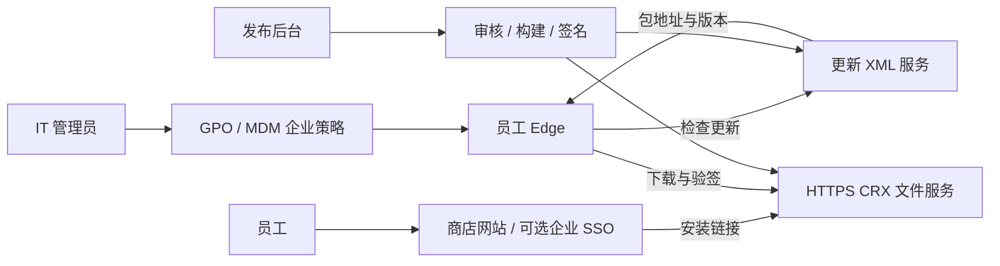

> 已被后续需求修订：用户没有管理员权限、IT 不配合，当前使用开发者模式加载本地目录。本文件中的企业策略方案不适用于当前实施条件；请以 [本地扩展更新方案](edge-local-extension-update-plan.md) 为准。

# 企业内部 Edge 扩展商店：可行性与方案

调研日期：2026-09-24。范围：公司内部、可统一管理的桌面设备。当前项目目录为空，无既有技术栈。设备操作系统、AD/Entra 加入状态、管理工具和网络范围尚待确认。

## 结论

有条件可行，优先采用「自建网站 + 企业策略预置信任 + CRX 托管 + Edge 原生自动更新」。员工可以在受信任网站选择扩展安装；强制安装仅用于公司必需扩展。普通网页本身不拥有任意安装扩展的特权。

Windows AD 域或混合加入是现有官方自托管指南明确覆盖的路线；纯 Entra 加入存在官方文档冲突，应先实机验证。不要把“已接入 Intune”当成自托管必然可用的证明。

## 证据与能力边界

| 发现 | 证据 | 置信度 |
|---|---|---|
| 企业支持自托管 CRX 和更新清单 | [S1] | 高，实际环境待测 |
| 预置安装来源与扩展 ID 策略后，可从网站直接安装 | [S1][S2] | 高 |
| 安装来源应同时覆盖入口页面与 CRX 地址 | [S2] | 高 |
| Edge 原生拉取 XML 并安装新版本，网站无需常开 | [S5] | 高 |
| 强制部署与允许用户关闭的自动部署是不同模式 | [S4] | 高 |
| 纯 Entra 加入是否支持自托管强装 | [S1]与[S3]表述不一致 | 未决，必须 PoC |
| 管理扩展无法通过 management API 任意安装 CRX | [S7] API 方法清单没有该接口 | 高，API 边界判断 |

S1 的自托管指南（2023-08-29）要求 Windows AD 或 hybrid joined，并排除纯 Entra；S3 的 ExtensionSettings 页面（2026-09-11）却允许 AD 或 Azure AD 加入设备强装商店外扩展。较新文档可能反映能力变化，但不足以证明所有版本、所有安装方式都支持。自选安装与强制安装也必须分别测。

## 三种方案

| 方案 | 员工体验 | 自主分发/更新 | 适用情况 |
|---|---|---|---|
| A：受信任内网商店 | 网站点击安装，由浏览器处理确认/启用 | 自托管，Edge 执行更新 | 推荐主方案，员工自选工具 |
| B：网站申请 + 企业策略部署 | 选择后等待审批与策略同步 | 自托管，Edge 执行更新 | 按部门授权、受控或强制部署 |
| C：自建目录 + 官方商店 | 跳转 Edge Add-ons 安装 | 官方审核和分发 | 自托管前提不满足时的备选 |

方案 C 可以使用官方 Hidden 可见性，让扩展不出现在搜索/浏览中，但持有链接的人仍能访问；Hidden 不是企业访问控制，也不是本地私有托管。[S6]

## 推荐架构



MVP 不需要自研桌面客户端，也不需要管理助手扩展。网站第一版可以只有目录、详情、权限说明、版本说明和安装按钮。发布后台先由少量管理员使用，不开放任意用户上传执行代码。

建议沿用团队熟悉的 Web 技术栈：单体 Web 服务 + 关系数据库 + HTTPS 文件存储即可；PoC 甚至可用静态网站与静态 XML。数据库记录扩展 ID、业务名称、版本、包位置、校验值、发布状态和审核记录。无需为更新协议先建设复杂微服务。

### 安装策略

优先统一使用 ExtensionSettings 管理，或明确沿用现有独立策略；不要让多个策略来源相互覆盖。[S3][S4]

自选安装需要：

- 将目录页面来源和 CRX 下载来源加入 install_sources / ExtensionInstallSources。
- 明确允许批准的扩展 ID；若公司默认禁止其他扩展，应设置逐 ID 例外。
- 网站用实际 HTTPS CRX 链接启动安装；不承诺零确认，验收时记录当前 Edge 的提示/启用行为。
- 严格限制信任范围，避免白名单覆盖可被员工上传任意 CRX 的公共路径。

以下是隔离测试策略示意，不能原样覆盖生产策略。默认 blocked 会影响公司现有扩展；必须先合并现有批准列表。域名与 ID 均为占位符。

```json
{
  "*": {
    "installation_mode": "blocked",
    "install_sources": [
      "https://extensions.example.com/*",
      "https://packages.example.com/*"
    ]
  },
  "aaaaaaaaaaaaaaaaaaaaaaaaaaaaaaaa": {
    "installation_mode": "allowed"
  }
}
```

对必须统一部署的单个扩展，可使用下列逐 ID 配置。normal_installed 自动安装但允许用户关闭；force_installed 禁止用户关闭/移除。两者不等同于网页点击安装。[S4]

```json
{
  "aaaaaaaaaaaaaaaaaaaaaaaaaaaaaaaa": {
    "installation_mode": "normal_installed",
    "update_url": "https://packages.example.com/demo/updates.xml",
    "override_update_url": true
  }
}
```

### 更新服务

扩展 manifest.json 中配置：

```json
{
  "update_url": "https://packages.example.com/demo/updates.xml"
}
```

这只是字段片段，不是完整扩展 manifest。更新端点返回：

```xml
<?xml version="1.0" encoding="UTF-8"?>
<gupdate xmlns="http://www.google.com/update2/response" protocol="2.0">
  <app appid="aaaaaaaaaaaaaaaaaaaaaaaaaaaaaaaa">
    <updatecheck codebase="https://packages.example.com/demo/1.1.0.crx"
                 version="1.1.0" />
  </app>
</gupdate>
```

Edge 定期检查，官方描述为每几小时；不是网站发布后立即全量生效。必须保留同一扩展的签名私钥，清单版本与包内版本一致且递增。[S5]

发布流程建议：构建与检查 → 签名 → 上传不可变版本包 → 验证下载 → 最后切换 XML。包可长期缓存，XML 使用短缓存。密钥独立受控保存，不入代码库，不放 Web 静态目录。每个扩展使用独立密钥。

故障恢复采用“旧代码重新发布为更高版本”，不要假设将 XML 改回旧版本即可自动降级；同时验证数据结构的向后兼容。灰度部署初期用独立试点组；同一 ID 分渠道更新若依赖策略 URL 覆盖，应先验证 override_update_url，不能只改首次安装地址。[S3][S4]

### 认证与安装状态

目录/后台可以 SSO 登录，但 CRX 与更新服务不能直接复用网站登录会话。更新清单请求不携带 Cookie，安装来源文档也要求文件不放在需要认证的位置。[S2][S5] 推荐把分发服务放在设备可访问的公司网络/VPN 内；离线设备恢复可达后再更新，必须测试代理、证书与 VPN 状态。

MVP 只记录“点击安装”，不能据此统计“安装成功”。普通网站不能随意读取完整扩展清单。后续可通过受管设备库存或自有扩展主动上报版本补充状态；需要设计设备/用户关联和最小数据采集。management API 可支持已安装扩展的管理，但不是任意 CRX 安装接口。[S7]

## 先验证再开发

建议先投入 1–3 个工作日做 PoC，此为工程估算，不含 IT 排期。验证通过后，小型 MVP 估算 2–4 周，前提是现有 SSO、域策略和基础设施可用；复杂审批/设备管理集成单独估算。

1. 确认终端环境 → 验证：在测试 Windows 上运行 `dsregcmd /status`，查看 `edge://version` 与 `edge://policy`，记录加入状态、浏览器版本和生效策略。报告中不保存敏感设备标识。
2. 制作 1.0.0 和 1.1.0 测试扩展 → 验证：同一私钥、同一扩展 ID、版本递增。
3. 配置隔离测试组与 HTTPS 托管 → 验证：用 `curl -I https://packages.example.com/demo/updates.xml` 和 CRX 地址确认可达、无登录跳转；用 `xmllint --noout updates.xml` 检查 XML。
4. 网站自选安装 → 验证：员工不需要开启开发者模式；允许扩展可装，未授权来源/ID 被拒绝；记录浏览器确认/启用步骤。
5. 原生更新 → 验证：发布 1.1.0，关闭商店网页后仍能更新，ID、已有设置与功能正常。调试可手动触发检查，验收必须包含自然轮询。
6. 验证失败场景 → 验证：错签名包不被接受、网络中断不破坏已安装版本、恢复可达后能更新、停用/撤回策略达到预期。
7. 如有纯 Entra 或 macOS → 验证：分别完成独立安装/更新矩阵；Windows 结果不能直接外推。

PoC 决策：通过 A 就开发目录商店；A 不通但 B 通则改为申请/部署；两者均不通且允许官方托管，则采用 C。移动端与 Linux 不在本轮已确认范围。

## 来源

以下均为官方资料，访问日期 2026-09-24。页面日期仅对已核对项记录，未确认的更新时间不推断。

- [S1 自托管指南](https://learn.microsoft.com/en-us/deployedge/microsoft-edge-manage-extensions-webstore)，2023-08-29；设备前提、打包、签名与自选分发。
- [S2 ExtensionInstallSources](https://learn.microsoft.com/en-us/deployedge/microsoft-edge-policies/ExtensionInstallSources)；来源双白名单、无需拖放、认证限制。
- [S3 ExtensionSettings](https://learn.microsoft.com/en-us/deployedge/microsoft-edge-policies/ExtensionSettings)，2026-09-11；策略优先级、平台约束、更新地址覆盖。
- [S4 策略详细指南](https://learn.microsoft.com/en-us/deployedge/microsoft-edge-manage-extensions-ref-guide)，2024-01-12；安装模式与字段语义。
- [S5 自动更新协议](https://learn.microsoft.com/en-us/microsoft-edge/extensions/update/auto-update)，2025-06-25；XML、版本、签名、轮询、Cookie 行为。该页存在部分与自托管上下文不一致的历史说明，协议字段与 S1 交叉核对使用。
- [S6 发布扩展](https://learn.microsoft.com/en-us/microsoft-edge/extensions/publish/publish-extension)；Hidden 可见性、官方商店发布及 MV3 远程代码限制。
- [S7 management API](https://developer.chrome.com/docs/extensions/reference/api/management)；Chromium 扩展管理 API 的方法范围。

## 验证状态与限制

文档级交叉核验已完成；状态为 CONFLICTS: 纯 Entra 加入支持范围。尚未操作任何企业设备、发布扩展、配置生产策略或执行浏览器安装测试。上述命令属于下一阶段验收计划，并非已执行结果。当前只新增本调研文档。
